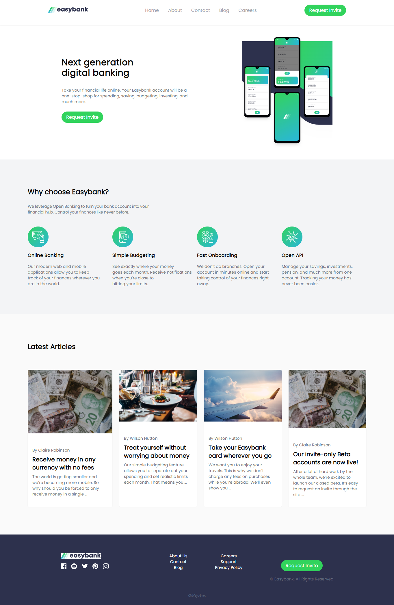

## Table of contents

- [Overview](#overview)
  - [Screenshot](#screenshot)
  - [Links](#links)
- [My process](#my-process)
  - [Built with](#built-with)
  - [Continued development](#continued-development)
- [Author](#author)

### Screenshot

### Links

- Solution URL: [solution URL](https://github.com/Oghenekparobo/Easy-bank)
- Live Site URL: [live site URL](https://easy-banklandingpage.netlify.app/)

## My process

### Built with

- HTML5 
- Tailwindcss Grid and Flex system

#### Continued development
--i couldn't make the hamburger to collapse back after you click on it, so i will be improving my js and work on my javascript skills.

## Author

- Frontend Mentor - [@yourusername](https://www.frontendmentor.io/profile/Oghenekparobo)
- Twitter - [@stephenjyd](https://www.twitter.com/stephenjyd)

